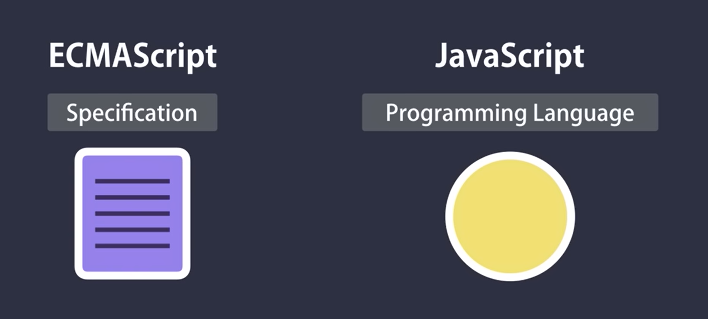
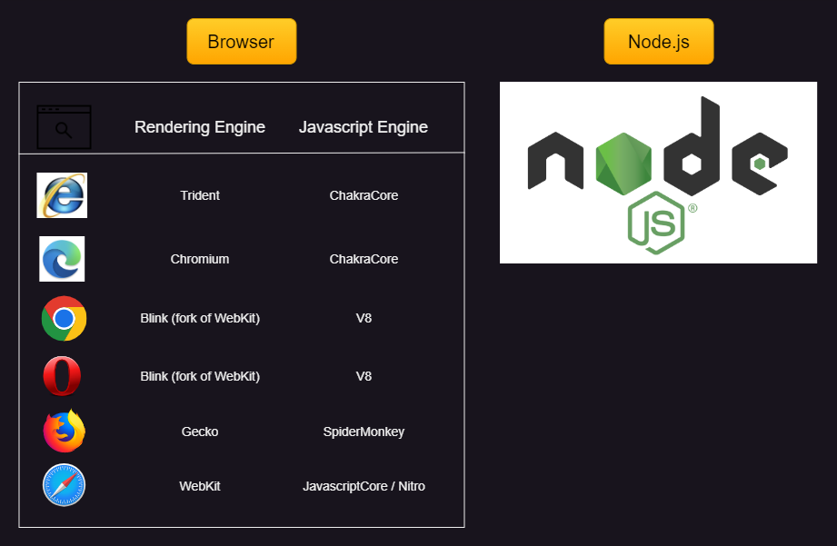

# JS_Topics

## What is JS?

## ECMAScript vs JS

## Tools (Where to run?)

## Variables
> Primitve types  
>> - String  
>> - Number  
>> - Boolean  
>> - undefined  
>> - null  

> Reference types  
>> - Object  
>> - Array  
>> - Function  
